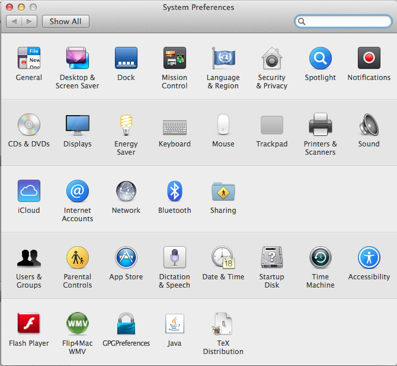
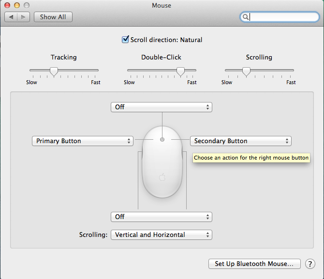

<a href="../README.md">Home</a>

# Apple Mouse
The Apple Mouse is more than a single button, although you need to make a change to take advantage of this. This page also talks about scrolling. 

## 'Right-click' - Enabling the Second Mouse Button
Most modern applications expect a 'right-click' to show context sensitive menus. This can be achieved by using the Ctrl key together with a click of the mouse. However, it can be even easier. You can setup the mouse to have a right-click. To do this, open System Preferences on the dock.

  

You will see the list of general preferences. Click on the Mouse icon.  

  

A screen with options for the mouse is shown. 

  

On the right, you will see an arrow with a drop-down menu available. On your machine, it will show the word 'Primary Button'. Select this drop-down menu and set this to 'Secondary Button', as shown in the above screenshot. 

You should only have to make this change once. The same menu button option should be available on the other iMacs in the room. 

## Scrolling 
The default scrolling for OS X is different to other operating systems. By default, if you use the ball on the top of the mouse to scroll through content, you will be using 'Natural Scrolling'. 

Natural Scrolling means that it works more like iOS and Android tablets and phones. If you move the mouse ball away from you (up), then you will scroll upwards. If you move the mouse ball towards you (down), then you will scroll downwards. 

This can feel unusual at first, but it quickly becomes 'natural'. If you prefer to have the traditional scrolling, go to the Mouse preferences and deselect the **Scroll direction: Natural** item. 

## Other features...? 
FIXME - add in discussion of other features of the mouse. 

<a href="../README.md">Home</a>

